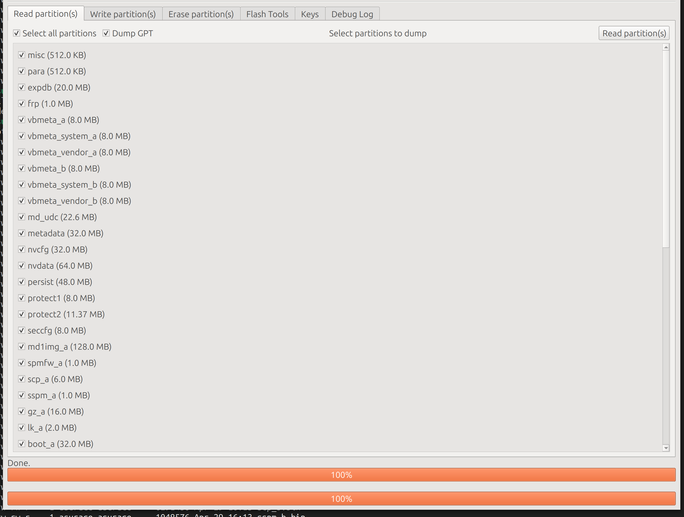

- [Intro](#intro)
- [Let's start](#lets-start)
  - [1) Enable developer settings -\> Enable OEM unlocking](#1-enable-developer-settings---enable-oem-unlocking)
  - [2) Install and configure the mtkclient](#2-install-and-configure-the-mtkclient)
    - [Install Pip requirements and mtkclient](#install-pip-requirements-and-mtkclient)
    - [Install rules](#install-rules)
  - [3) Brom mode](#3-brom-mode)
  - [4) Once bootloader is unlocked download your GSI of choice](#4-once-bootloader-is-unlocked-download-your-gsi-of-choice)
  - [5) Download vbmeta.img from google](#5-download-vbmetaimg-from-google)
  - [6) Open up CMD/Powershell and cd into your ADB folder](#6-open-up-cmdpowershell-and-cd-into-your-adb-folder)
    - [a) Enter bootloader](#a-enter-bootloader)
    - [b) Enter fastboot](#b-enter-fastboot)
    - [c) Enter recovery:](#c-enter-recovery)
  - [Not tested](#not-tested)
  - [Problems:](#problems)
    - [3.5 mm Audio Jack problem:](#35-mm-audio-jack-problem)
    - [For debloating with universal debloater I ran into issue were tablet would restart after unlocking](#for-debloating-with-universal-debloater-i-ran-into-issue-were-tablet-would-restart-after-unlocking)
    - [fastboot commands fails](#fastboot-commands-fails)
    - [fastboot flash system system.img error](#fastboot-flash-system-systemimg-error)
    - [Every seems fine but the tablet never load and it stucks to the lenovo screen](#every-seems-fine-but-the-tablet-never-load-and-it-stucks-to-the-lenovo-screen)
    - [Fix the alert message that the tablet is not secure](#fix-the-alert-message-that-the-tablet-is-not-secure)

# Intro

Why should I update my Lenovo Tablet M9 with a custom Firmware?

The facts:

- The original ROM is slow
- You cannot use the secondary SD card to install your apps

This is not an easy process and you can risk to brick your device. I had 2 times this feeling.

# Let's start

## 1) Enable developer settings -> Enable OEM unlocking 

You need to enable usb-debugging via Settings/About phone/Version, Tap 7x on build number

Go to Settings/Additional settings/Developer options, enable "OEM unlock" and "USB Debugging"

## 2) Install and configure the mtkclient

https://github.com/bkerler/mtkclient

Ubuntu:

```bash
sudo apt install python3 git libusb-1.0-0 python3-pip libfuse2 python python3.12-venv
```

### Install Pip requirements and mtkclient

Login as normal user

```bash
python3 -m venv ~/.venv
git clone https://github.com/bkerler/mtkclient
cd mtkclient
. ~/.venv/bin/activate
pip install -r requirements.txt
pip install .
```

### Install rules

```bash
sudo usermod -a -G plugdev $USER
sudo usermod -a -G dialout $USER
sudo cp mtkclient/Setup/Linux/*.rules /etc/udev/rules.d
sudo udevadm control -R
sudo udevadm trigger
```

Reboot your computer

## 3) Brom mode

Login as normal user

```bash
. ~/.venv/bin/activate
python mtk_gui.py
```

[How to go in BROM mode safely](https://xdaforums.com/t/lenovo-tab-m9-unlocking-bootloader.4588191/post-89067455):

In my case I had a good reproducable connection (in Brom mode) with the following method:
- Start MTK-Client GUI (used Re LiveDVD)
- Shutdown Tablet
- Press and hold VOL+ and VOL- while connecting USB
- Wait till MTK-Client shows connected (actually it was some memory adress 0X00000x that appeared I don't remember exactly)
- Release VOL+ and VOL-

Also worth to mention that the MTK-Client only recognizes *.bin files so one must rename them if Magisk saved them as *.img files.

Alternative:

Starting the mtk gui, reboot the device and connect it via USB while booting, then on lenovo boot screen hold all 3 buttons for like 3s.

**DOWNLOAD At least** boot_a, boot_b, vbmeta_a, vbmeta_b




UNLOCK THE BOOTLOADER via gui or [cmdline](https://github.com/bkerler/mtkclient#unlock-bootloader)


At this point detach the usb cable and reattach.

A message is showed saying that the device is untrusted. **To continue the boot press the power button.**

Close the MTKclient.

## 4) Once bootloader is unlocked download your GSI of choice

Which image to use?


See https://sourceforge.net/projects/andyyan-gsi/files/

I am currently using lineage-21.0-20241018-UNOFFICIAL-arm64_bgN-signed. Keep in mind this is an A/B device with a dynamic super partition so make sure you download the proper GSI. Also since this is a MTK device you may have better compatibility with AndyYan or ponces builds. Lineage21 so far has been working great for me

Download it from https://sourceforge.net/projects/andyyan-gsi/files/lineage-21-td/History/

Directly:
https://sourceforge.net/projects/andyyan-gsi/files/lineage-21-td/History/lineage-21.0-20241018-UNOFFICIAL-arm64_bgN-signed.img.gz/download

## 5) Download vbmeta.img from google

(https://dl.google.com/developers/android/qt/images/gsi/vbmeta.img -- empty one) or take it from your Lenovo PC software dump, place vbmeta.img and extract and rename your GSI image system.img and place in your ADB folder

## 6) Open up CMD/Powershell and cd into your ADB folder

Install fastboot and adb packages.

On Ubuntu:

```bash
sudo apt install fastboot adb
```

To boot to fastboot: plug in USB cable then press and hold power + up volume until you see the tablet booting. The tablet gives you a screen and you need to choose volume down. Confirm that you are connected with command line "fastboot devices" and you should see your device listed.

```bash
fastboot getvar all
```

### a) Enter bootloader

```bash
fastboot --disable-verification flash vbmeta vbmeta.img
```

Output example:
```
Rewriting vbmeta struct at offset: 0
Sending 'vbmeta_b' (8192 KB) OKAY [ 5.139s]
Writing 'vbmeta_b' OKAY [ 0.150s]
Finished. Total time: 5.406s
```

### b) Enter fastboot

```bash
fastboot reboot fastboot
```

```bash
fastboot erase system
```

Output example:
```
Erasing 'system_a' OKAY [ 0.781s]
Finished. Total time: 0.790s
```

```bash
fastboot delete-logical-partition product_b
```

Output example:
```
Deleting 'product_b' OKAY [ 0.011s]
Finished. Total time: 0.011s
```

```bash
fastboot flash system system.img
```

Output example:
```
Resizing 'system_a' OKAY [ 0.005s]
Sending sparse 'system_a' 1/9 (262108 KB) OKAY [ 6.862s]
Writing 'system_a' OKAY [ 1.676s]
Sending sparse 'system_a' 2/9 (262048 KB) OKAY [ 6.760s]
Writing 'system_a' OKAY [ 1.700s]
Sending sparse 'system_a' 3/9 (261996 KB) OKAY [ 6.774s]
Writing 'system_a' OKAY [ 1.677s]
Sending sparse 'system_a' 4/9 (261948 KB) OKAY [ 6.882s]
Writing 'system_a' OKAY [ 1.698s]
Sending sparse 'system_a' 5/9 (261968 KB) OKAY [ 6.965s]
Writing 'system_a' OKAY [ 1.699s]
Sending sparse 'system_a' 6/9 (262060 KB) OKAY [ 6.828s]
Writing 'system_a' OKAY [ 1.684s]
Sending sparse 'system_a' 7/9 (262104 KB) OKAY [ 6.791s]
Writing 'system_a' OKAY [ 1.721s]
Sending sparse 'system_a' 8/9 (260422 KB) OKAY [ 6.777s]
Writing 'system_a' OKAY [ 1.702s]
Sending sparse 'system_a' 9/9 (162296 KB) OKAY [ 4.193s]
Writing 'system_a' OKAY [ 1.515s]
Finished. Total time: 74.434s
```

### c) Enter recovery:

Either directly in the Fastbootd menu

or Press Volume Up, Volume Down, and Power buttons simultaneously until the Lenovo logo appears

Wipe data/factory reset

Reboot, profit **wait at least 10-20 secs before something happens**

If you want root:

a) Patch the boot.img you got from the stock firmware with Magisk on your tablet  
b) Place patched .img back into your ADB folder and rename boot.img  
c) Enter bootloader  
```bash
fastboot flash boot boot.img
fastboot reboot
```
Done

Follow Info here https://github.com/bkerler/mtkclient#root-the-phone-tested-with-android-9---12:

```bash
python mtk.py r boot,vbmeta boot.img,vbmeta.img
```

https://xdaforums.com/t/lenovo-tab-m9-unlocking-bootloader.4588191/post-89067455

dump all 4  
patch and flash boot_a/_b  
flash vbmeta.img.empty from the repo for vbmeta_a/_b  
Order doesn't matter, just got to flash all 4 before reboot.

## Not tested

(you can skip the following Lenovo LMSA steps if you do not need root)

Download and install Lenovo Software Fix:
https://support.lenovo.com/us/en/downloads/ds101291-rescue-and-smart-assistant-lmsa

Go through the setup and download the latest firmware. Make sure it matches the firmware currently installed on your tablet

Take the vbmeta.img and boot.img from C:\ProgramData\RSA\Download\RomFiles\TB310FU_S000889_240913_ROW\image and place in a folder along with your ADB files

## Problems:

### 3.5 mm Audio Jack problem:

https://xdaforums.com/t/lenovo-tab-m9-unlocking-bootloader.4588191/post-89815292

Solutions: config / phh settings / misc Features/ enable "use alternate way" and "disable audio effects" / reboot

or:

https://xdaforums.com/t/lenovo-tab-m9-unlocking-bootloader.4588191/post-89816278

--Phh Settings -> Misc features--

- Enable "use alternate way to detect headsets" (reboot, if 3.5 jack still isn't working then use termux app and type su to grant root and then run this command: setprop persist.sys.overlay.devinputjack true

- Enable" Rotation perf hint instead of touch"

- Enable Mediatek GED KPI support

- Enable "Disable SF GL backpressure"

- Enable "Disable SF HWC backpressure"

- Enable "Use System Wide BT HAL"

- Remove telophony subsystem

### For debloating with universal debloater I ran into issue were tablet would restart after unlocking

There is a fix that disables checking for firmware updates though.
https://github.com/0x192/universal-android-debloater/issues/713#issuecomment-1566441573

### fastboot commands fails

https://xdaforums.com/t/fastboot-flash-system-partition-not-found.3992977/

At point 5 using fastboot commands:

```bash
fastboot erase system
```

Error example:
```
Erasing 'system' (bootloader) system
FAILED (remote: 'Partition table doesn't exist')
fastboot: error: Command failed
```

or 

```bash
fastboot delete-logical-partition product_b
```

Error example:
```
Deleting 'product_b' FAILED (remote: 'unknown command')
fastboot: error: Command failed
```

or

```bash
fastboot flash system system.img
```

Error example:
```
Warning: skip copying system image avb footer (system partition size: 0, system image size: 140724689237784).
Sending sparse 'system' 1/18 (131052 KB) OKAY [ 82.053s]
Writing 'system' FAILED (remote: 'This partition doesn't exist')
fastboot: error: Command failed
```

You need to go in fastboot with the command:

```bash
fastboot reboot fastboot
```

### fastboot flash system system.img error

```bash
fastboot flash system system.img
```

Error example:
```
Resizing 'system_a' FAILED (remote: 'Not enough space to resize partition')
fastboot: error: Command failed
```

Solution:

```bash
fastboot delete-logical-partition system_ext_a
fastboot delete-logical-partition system_ext_b
fastboot delete-logical-partition product_a
fastboot delete-logical-partition product_b
```

### Every seems fine but the tablet never load and it stucks to the lenovo screen

One possible cause is the wrong vbmeta.img.

I used the vbmeta_a.bin as my vbmeta.img and this didn't work. The tablet was always hanging on the Lenovo boot screen.

Use the empty vbmeta.img referred in point (4)

### Fix the alert message that the tablet is not secure

https://xdaforums.com/t/flashing-twrp-and-lineage-to-an-already-rooted-lenovo-tab-m-9.4671584/post-89863306

```bash
fastboot oem cdms
```
